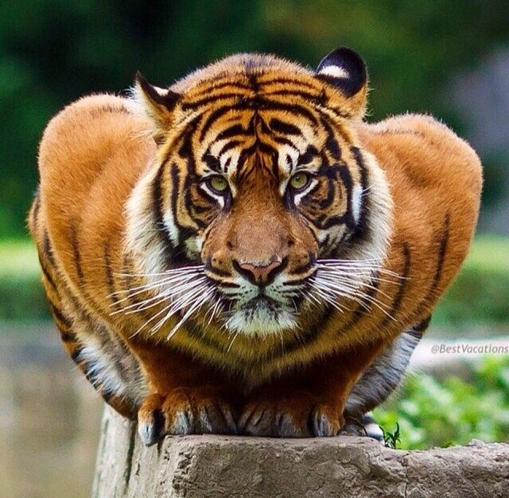
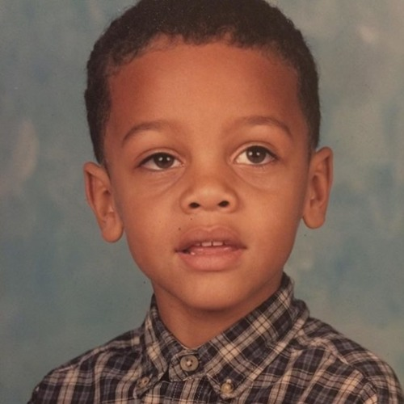
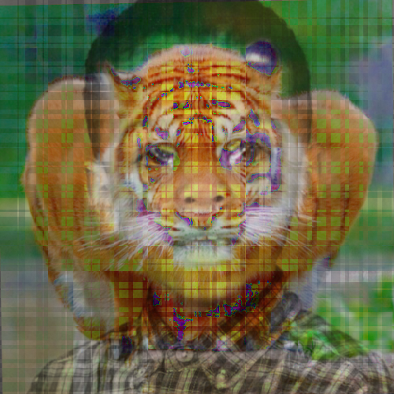

# Quadrant Blend Results

These can have some disturbing results.

`i5-3570k @ 4.1 GHz`

## Input Images

#### Style Image



#### Target Image



## Zero Quadrants

  

```
$ ./style_transfer.exe images/tiger.jpg images/kid.jpg -m=blend -wv=0.96 -ws=0.96 -q=0

Image type is:                  8UC3
Image size is:                  640x627
Image type is:                  8UC3
Image size is:                  500x500
Scaled Template Image size is:          640x626
Scaled Target Image size is:            500x500

Template Quadrants:     1
Target Quadrants:       1

Pre-Process Time Elapsed: 163 (ms)

Begin Image Registration

Begin findTransformECC

Begin warpAffine

Registration Time Elapsed: 109 (ms)

Begin Style Transfer

Begin splitting planes

Begin transfer loop

Mode: "blend"

Style Transfer Time Elapsed: 8 (ms)

Merge Time Elapsed: 2 (ms)

Process Time Elapsed: 964 (ms)
Wrote ./out/style_output/TODO/q_0.png

Post-Process Time Elapsed: 140 (ms)
```

## Five Quadrants

  

```
$ ./style_transfer.exe images/tiger.jpg images/kid.jpg -m=blend -q=5

Image type is:                  8UC3
Image size is:                  640x627
Image type is:                  8UC3
Image size is:                  500x500
Scaled Template Image size is:          640x626
Scaled Target Image size is:            500x500

Template Quadrants:     1024
Target Quadrants:       1024

Pre-Process Time Elapsed: 161 (ms)

Begin Image Registration

Begin findTransformECC

Begin warpAffine

Registration Time Elapsed: 109 (ms)

Begin Style Transfer

Begin splitting planes

Begin transfer loop

Mode: "blend"

Style Transfer Time Elapsed: 47 (ms)

Merge Time Elapsed: 2 (ms)

Process Time Elapsed: 620 (ms)
Wrote ./out/style_output/TODO/q_5.png

Post-Process Time Elapsed: 132 (ms)
```

## Eight Quadrants

  

```
$ ./style_transfer.exe images/tiger.jpg images/kid.jpg -m=blend -q=8 -wv=0.96 -ws=0.01

Image type is:                  8UC3
Image size is:                  640x627
Image type is:                  8UC3
Image size is:                  500x500
Scaled Template Image size is:          640x626
Scaled Target Image size is:            500x500

Template Quadrants:     65536
Target Quadrants:       65536

Pre-Process Time Elapsed: 328 (ms)

Begin Image Registration

Begin findTransformECC

Begin warpAffine

Registration Time Elapsed: 104 (ms)

Begin Style Transfer

Begin splitting planes

Begin transfer loop

Mode: "blend"

Style Transfer Time Elapsed: 446 (ms)

Merge Time Elapsed: 2 (ms)

Process Time Elapsed: 785 (ms)
Wrote ./out/style_output/TODO/q_8.png

Post-Process Time Elapsed: 137 (ms)
```
