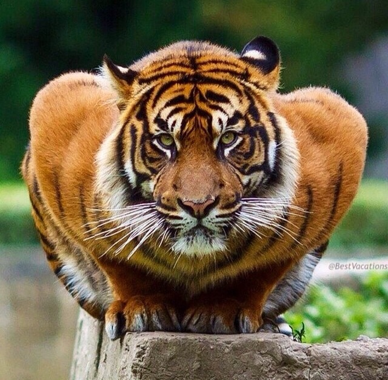
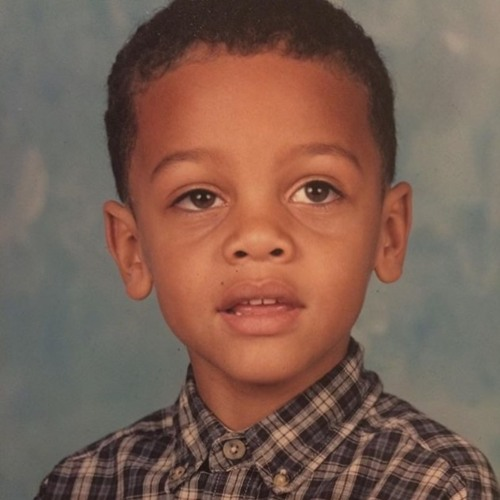
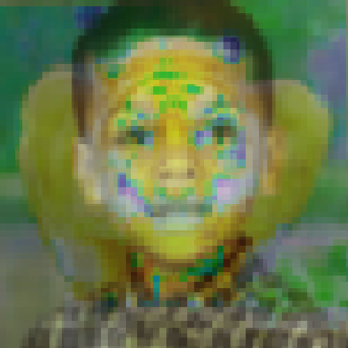
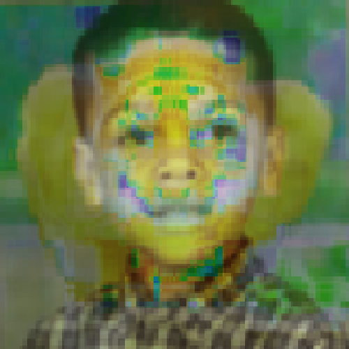

# Quadrant Mean Results

i5-3570k @ 4.1 GHz

## Input Images

#### Style Image



#### Target Image



## Three Quadrants

  

```
$ ./style_transfer.exe images/tiger.jpg images/kid.jpg -m=mean -q=3

Image type is:                  8UC3
Image size is:                  640x627
Image type is:                  8UC3
Image size is:                  500x500
Scaled Template Image size is:          640x626
Scaled Target Image size is:            500x500

Template Quadrants:     64
Target Quadrants:       64

Pre-Process Time Elapsed: 201 (ms)

Begin Image Registration

Begin findTransformECC

Begin warpAffine

Registration Time Elapsed: 108 (ms)

Begin Style Transfer

Begin splitting planes

Begin transfer loop

Mode: "mean"

Style Transfer Time Elapsed: 126 (ms)

Merge Time Elapsed: 2 (ms)

Process Time Elapsed: 735 (ms)
Wrote ./out/style_output/TODO/q_3.png

Post-Process Time Elapsed: 131 (ms)
```

## Five Quadrants

  

```
$ ./style_transfer.exe images/tiger.jpg images/kid.jpg -m=mean -q=5

Image type is:                  8UC3
Image size is:                  640x627
Image type is:                  8UC3
Image size is:                  500x500
Scaled Template Image size is:          640x626
Scaled Target Image size is:            500x500

Template Quadrants:     1024
Target Quadrants:       1024

Pre-Process Time Elapsed: 166 (ms)

Begin Image Registration

Begin findTransformECC

Begin warpAffine

Registration Time Elapsed: 105 (ms)

Begin Style Transfer

Begin splitting planes

Begin transfer loop

Mode: "mean"

Style Transfer Time Elapsed: 1395 (ms)

Merge Time Elapsed: 1 (ms)

Process Time Elapsed: 1848 (ms)
Wrote ./out/style_output/TODO/q_5.png

Post-Process Time Elapsed: 142 (ms)
```

## Seven Quadrants

  

```
$ ./style_transfer.exe images/tiger.jpg images/kid.jpg -m=mean -q=7

Image type is:                  8UC3
Image size is:                  640x627
Image type is:                  8UC3
Image size is:                  500x500
Scaled Template Image size is:          640x626
Scaled Target Image size is:            500x500

Template Quadrants:     16384
Target Quadrants:       16384

Pre-Process Time Elapsed: 185 (ms)

Begin Image Registration

Begin findTransformECC

Begin warpAffine

Registration Time Elapsed: 100 (ms)

Begin Style Transfer

Begin splitting planes

Begin transfer loop

Mode: "mean"

Style Transfer Time Elapsed: 18885 (ms)

Merge Time Elapsed: 2 (ms)

Process Time Elapsed: 19612 (ms)
Wrote ./out/style_output/TODO/q_7.png

Post-Process Time Elapsed: 128 (ms)
```

## Eight Quadrants

  

```
$ ./style_transfer.exe images/tiger.jpg images/kid.jpg -m=mean -q=8

Image type is:                  8UC3
Image size is:                  640x627
Image type is:                  8UC3
Image size is:                  500x500
Scaled Template Image size is:          640x626
Scaled Target Image size is:            500x500

Template Quadrants:     65536
Target Quadrants:       65536

Pre-Process Time Elapsed: 301 (ms)

Begin Image Registration

Begin findTransformECC

Begin warpAffine

Registration Time Elapsed: 104 (ms)

Begin Style Transfer

Begin splitting planes

Begin transfer loop

Mode: "mean"

Style Transfer Time Elapsed: 76444 (ms)

Merge Time Elapsed: 2 (ms)

Process Time Elapsed: 77216 (ms)
Wrote ./out/style_output/TODO/q_8.png

Post-Process Time Elapsed: 132 (ms)
```
